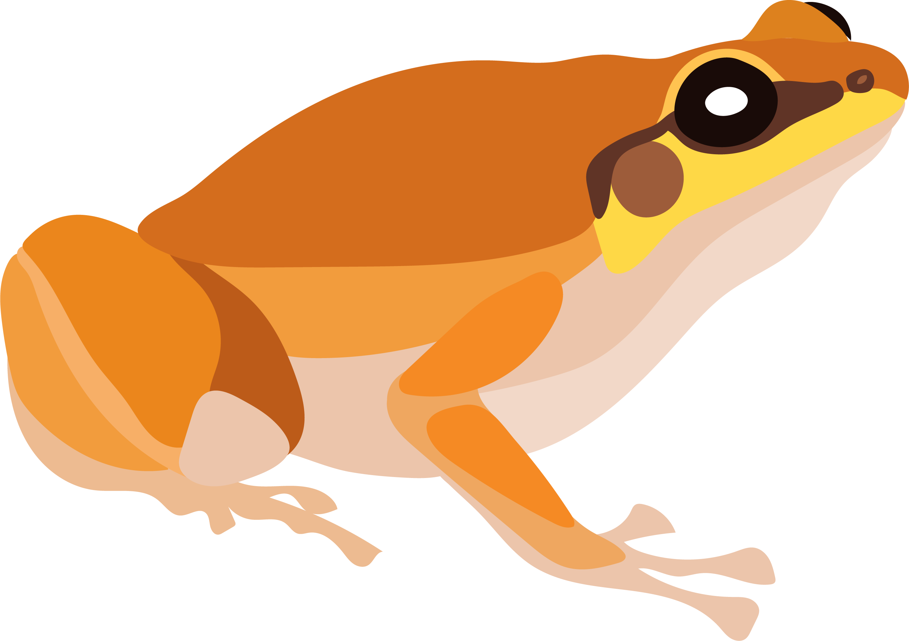

# Microhylidae Phylogenomics

Data and scripts to accompany our research on the phylogenomics and morphological evolution of Australian microhylid frogs.  

## [Alignments](https://github.com/IanGBrennan/Microhylidae/tree/main/Alignments)  
Individual locus and concatenated alignments of new AHE data (*Asterophryinae...*) combined with microhylid samples from Hime et al. 2021 (*Microhylidae_Combined...*.  

## [Data](https://github.com/IanGBrennan/Microhylidae/tree/main/Data)
Datasets for analyses and figures

## [Figures](https://github.com/IanGBrennan/Microhylidae/tree/main/Figures)
Manuscript figures, including frog illustrations which are free for use!

## [Scripts](https://github.com/IanGBrennan/Microhylidae/tree/main/Scripts)
Code for analysis and visualization

## [Trees](https://github.com/IanGBrennan/Microhylidae/tree/main/Trees)
Phylogenetic trees: per locus trees from IQTREE, species tree from ASTRAL, and timetree from MCMCtree
 
